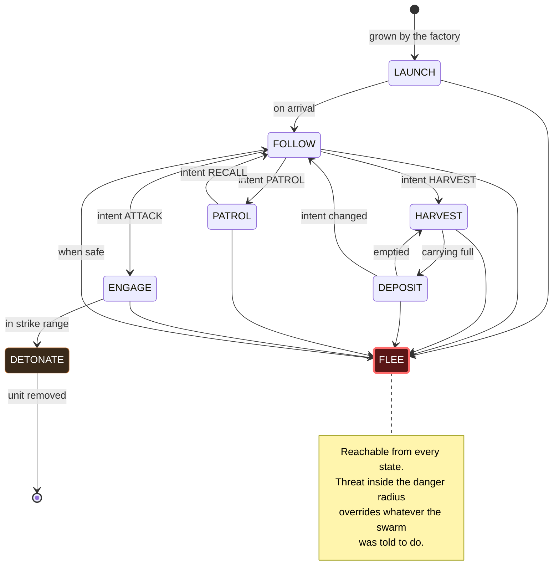

# The state machine

[Back to contents](index.md) | Previous: [The swarm](02-the-swarm.md) | Next: [The economy](04-economy.md)

---

## Two tiers at once

A Thargon's behaviour is decided at two levels simultaneously.

**Tier 1, swarm intent.** What the swarm has been told to do. Runs every frame
regardless of what the Thargon is personally doing.

**Tier 2, the Thargon's own state.** What this particular Thargon is actually
doing right now.

Each state is a *recipe of steering weights*, not new movement code. Entering a
state enables some behaviours and disables others. Nothing about how a Thargon
moves changes between states — only what it is currently paying attention to.

That is why adding a state is cheap: it is a list of behaviour names, not an
implementation.

---

## The states

Count the arrows into FLEE. Every other state has one, and that spray is the
diagram's actual content: the tidy chain down the middle is what the swarm is
*told* to do, and the red convergence is what it does instead when frightened.

| State | Entered when | Steering recipe |
|---|---|---|
| `LAUNCH` | Freshly grown by the factory | Seek toward the Interceptor |
| `FOLLOW` | Default; intent is FOLLOW and it is safe | Flocking triple plus offset pursue |
| `HARVEST` | Intent is HARVEST, Barnacle in range | Arrive at the Barnacle, drain Meta-Alloys |
| `DEPOSIT` | Carrying Meta-Alloys | Arrive at the Interceptor, transfer |
| `ENGAGE` | Intent is ATTACK, target designated | Pursue with lead, plus separation |
| `PATROL` | Intent is PATROL, point designated | Follow a path around the point |
| `FLEE` | Threat in danger radius — from any state | Flee the threat, plus separation |
| `DETONATE` | Within strike distance | None; trigger the blast, then remove |

---

## The flee reflex

FLEE is reachable from every state. A Thargon that sees a threat inside its
danger radius abandons whatever it was told to do and scatters.

This is the single most important behaviour in the game for the brief, and it
is also the one most grounded in canon rather than invented for the mechanic.
Thargoids evolved on harsh ammonia worlds and are described as having
"overdeveloped survival instincts" — the trait that kept the species alive
across a couple of million years is exactly a willingness to break off and
survive rather than hold a line. A Thargon abandoning its orders to flee is
the species trait showing up at the unit level, not a coded-in cowardice.

An agent that always obeys reads as a puppet. An agent that *disobeys in order
to survive*, and then sheepishly returns to work, reads as something with its
own interests. The swarm is not disciplined. It is alive, and it would rather
not die for you.

[DRAFT — Mae: the paragraph above is the argument for why this satisfies "a
mind of its own". Worth making it yours, it is the thesis of the whole
artefact.]

### Where the reflex lives

The check does not live in each state. It lives in the **global state**, which
runs every frame after whichever state is current. That is what makes FLEE a
genuine reflex rather than eight copies of the same `if`: no state knows the
reflex exists, and adding a ninth state gets it for free.

### Hysteresis

Returning from FLEE is deliberately asymmetric. A Thargon enters FLEE at the
threat's danger radius, but will not leave until it is that radius *plus a
margin* away.

Without that gap, a Thargon sitting exactly on the boundary satisfies both the
entry and exit conditions on alternating frames and vibrates in place. The
margin is not polish; it is what makes the state stable at all.

---

## Intent is a suggestion

The swarm is told what to do. Each Thargon decides whether to comply.

In practice, that means intent biases which Tier-2 state a Thargon prefers,
and the Thargon overrides it whenever its own survival is at stake. The player
is commanding a creature, not driving a vehicle — and the difference is
legible precisely at the moment the swarm ignores an order to save itself.
