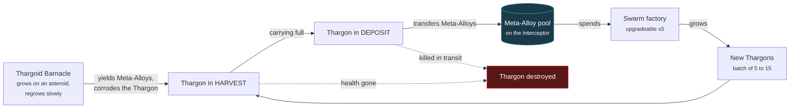

# The economy

[Back to contents](index.md) | Previous: [The state machine](03-state-machine.md) | Next: [The opposition](05-opposition.md)

**Not built yet — Phase 3.**

---

## Meta-Alloy flow

The setting is a single asteroid belt. Thargoid Barnacles are organic growths
that seed onto the asteroids themselves — the asteroid is the substrate, the
Barnacle is the harvestable growth on it, not the asteroid entire. That is
also why a Barnacle is a producer rather than a deposit: canon has Barnacles
actively extracting resources from the rock and converting them into
Meta-Alloys, so a worked Barnacle regrows slowly rather than being mined out
to nothing.

The dashed arrows are the point. The loop is **lossy**: a Thargon can die at
the Barnacle or on the way home, so Meta-Alloy-per-Thargon is not guaranteed
to be positive. That is what stops "send everyone to harvest" from being
trivially correct.

1. A Thargon in `HARVEST` arrives at a Barnacle and draws off the Meta-Alloys
   it has extracted from the asteroid.
2. The Barnacle corrodes the Thargon the whole time it works.
3. When full, the Thargon enters `DEPOSIT` and carries the Meta-Alloys back to
   the Interceptor.
4. The Interceptor adds them to the hive's single Meta-Alloy pool.
5. The factory spends from that pool to grow a batch of five to fifteen
   Thargons.

---

## Why the Barnacles are caustic

Making harvesting *dangerous* rather than merely *slow* does three things:

**It makes the economy a decision.** A slow economy is just a timer. An
economy that costs you Thargons means every harvesting run is a wager.

**It fires the flee reflex during peacetime.** A Thargon whose health drops
while harvesting will break off and scatter. That means the swarm reads as
alive even when nothing is attacking you — which matters, because the demo
video will spend most of its length not in combat.

**It makes Meta-Alloys-per-Thargon uncertain.** A Thargon can die before
depositing, so the loop is lossy. That is what stops "send everyone to
harvest" being the obviously correct move.

---

## Why the factory is on the Interceptor

The factory is a module on the Interceptor, not a static base.

Thargoids are nomadic: canon describes them as existing entirely in space or
within fabricated hives, never in a settlement they leave behind. A
ship-mounted factory follows from that directly, rather than being invented to
dodge base-building scope.

You carry your own production with you. There is no base to defend, no second
thing to lose, and no build order. Killing the Interceptor ends the match, and
that is the only way to end it — see [the opposition](05-opposition.md).

The alternative, a fixed structure, would add territory pressure and a second
win condition. It was rejected as scope: one deadline, one thing to protect.

---

## Upgrades

The factory upgrades five times. Each level increases batch size, growth rate,
or both.

The five levels are not an arbitrary number: canon's Interceptor line scales
in exactly five named steps by Thargon capacity — Cyclops (32), Basilisk (64),
Medusa (96), Hydra (128), then Orthrus. Upgrading the factory is framed as the
hive's Interceptor becoming a heavier hull in that line, not just "a bigger
batch size" with no fictional weight behind it.

[DRAFT — Mae: unspecified on purpose. Worth deciding whether upgrades cost
Meta-Alloys (competing with Thargon production, so it is a real trade) or
arrive on a timer (simpler, but then it is not a decision). The first is more
interesting and costs nothing extra to implement, since the Meta-Alloy pool
already exists.]
