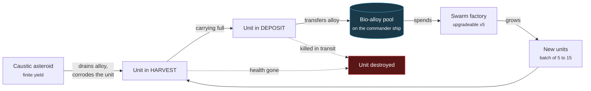

# The economy

[Back to contents](index.md) | Previous: [The state machine](03-state-machine.md) | Next: [The opposition](05-opposition.md)

**Not built yet — Phase 3.**

---

## Alloy flow

The dashed arrows are the point. The loop is **lossy**: a unit can die at the
asteroid or on the way home, so alloy-per-unit is not guaranteed to be
positive. That is what stops "send everyone to harvest" from being trivially
correct.

1. A unit in `HARVEST` arrives at an asteroid and drains alloy from it.
2. The asteroid corrodes the unit the whole time it works.
3. When full, the unit enters `DEPOSIT` and carries the alloy back to the ship.
4. The ship adds it to the faction's single bio-alloy pool.
5. The factory spends from that pool to grow a batch of five to fifteen units.

---

## Why the asteroids are caustic

Making harvesting *dangerous* rather than merely *slow* does three things:

**It makes the economy a decision.** A slow economy is just a timer. An economy
that costs you units means every harvesting run is a wager.

**It fires the flee reflex during peacetime.** A unit whose health drops while
harvesting will break off and scatter. That means the swarm reads as alive even
when nothing is attacking you — which matters, because the demo video will
spend most of its length not in combat.

**It makes alloy-per-unit uncertain.** A unit can die before depositing, so the
loop is lossy. That is what stops "send everyone to harvest" being the
obviously correct move.

---

## Why the factory is on the ship

The factory is a module on the commander vessel, not a static base.

You carry your own production with you. There is no base to defend, no second
thing to lose, and no build order. Killing the commander ends the match, and
that is the only way to end it — see [the opposition](05-opposition.md).

The alternative, a fixed structure, would add territory pressure and a second
win condition. It was rejected as scope: one deadline, one thing to protect.

---

## Upgrades

The factory upgrades five times. Each level increases batch size, growth rate,
or both.

[DRAFT — Mae: unspecified on purpose. Worth deciding whether upgrades cost
alloy (competing with unit production, so it is a real trade) or arrive on a
timer (simpler, but then it is not a decision). The first is more interesting
and costs nothing extra to implement, since the alloy pool already exists.]
